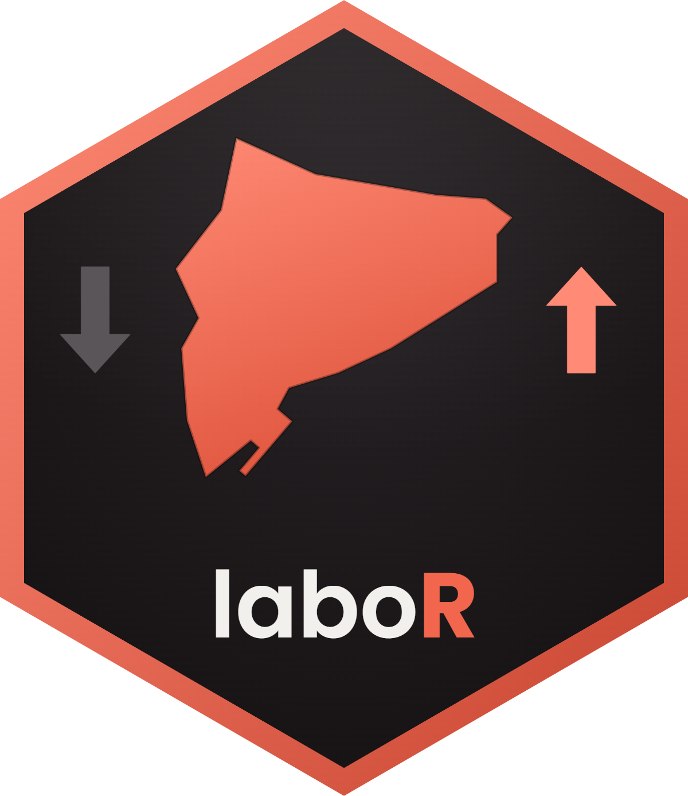

# laboR 

<!-- badges: start -->
<!-- badges: end -->

**[CA]** `laboR` descarrega les dades d'**atur registrat** i de
**contractació laboral** que publica l'[Observatori del Treball i Model
Productiu](https://observatoritreball.gencat.cat/) de la Generalitat de
Catalunya: sèries mensuals des del gener de 2011 per a Catalunya,
províncies, comarques i municipis, amb múltiples variables de desagregació.

**[EN]** `laboR` is an R package to download **registered unemployment**
and **labour contracts** data published by the Employment Observatory of
the Government of Catalonia (Spain): monthly series since January 2011 at
the Catalonia, province, county (*comarca*) and municipality levels, with
several breakdown variables. Documentation is in Catalan.

## Instal·lació / Installation

```r
# install.packages("remotes")
remotes::install_github("gerardreverte/laboR")
```

## Exemple ràpid / Quick example

```r
library(laboR)

# Atur registrat d'un municipi, tot el 2024 / Registered unemployment
mesos_2024 <- format(seq(as.Date("2024-01-01"), as.Date("2024-12-01"),
                         by = "month"), "%Y%m")
atur <- descarrega_atur_municipis("08121", mes = mesos_2024)

# Contractes per jornada i sexe / Contracts by working day and sex
contractes <- descarrega_contractacio_municipis(
  "08121", mes = "202501",
  variable_files = "jornada", variable_cols = "sexe"
)

# Llistes de referència / Reference lists
obtenir_municipis()
llistar_variables_atur()
llistar_variables_contractacio("ett")
```

El manual complet és a la vinyeta: `vignette("laboR")`.

## Funcions principals

| Atur registrat | Contractació |
|---|---|
| `descarrega_atur_catalunya()` | `descarrega_contractacio_catalunya()` |
| `descarrega_atur_provincies()` | `descarrega_contractacio_provincies()` |
| `descarrega_atur_comarques()` | `descarrega_contractacio_comarques()` |
| `descarrega_atur_municipis()` | `descarrega_contractacio_municipis()` |

## Secret estadístic / Statistical disclosure control

En municipis petits, les cel·les amb valors petits se suprimeixen per
secret estadístic (el servidor retorna `"#"`): el paquet les converteix en
`NA`, de manera que les columnes de valors són sempre numèriques.

*Small-value cells in small municipalities are suppressed at source
(returned as `"#"`); the package converts them to `NA` so that value
columns are always numeric.*

## Dades i citació / Data and citation

Les dades pertanyen a l'**Observatori del Treball i Model Productiu**
(Generalitat de Catalunya). Si utilitzes aquest paquet en treballs,
informes o publicacions, cita la font de les dades i, si et sembla bé,
també el paquet:

*The data belong to the Employment Observatory of the Government of
Catalonia. If you use this package, please credit the data source and,
if possible, cite the package:*

```r
citation("laboR")
#> Reverté Calvet, G. (2026). laboR: descàrrega de dades d'atur registrat
#> i contractació de l'Observatori del Treball i Model Productiu
#> (Generalitat de Catalunya). R package version 0.1.0.
#> https://github.com/gerardreverte/laboR
```
